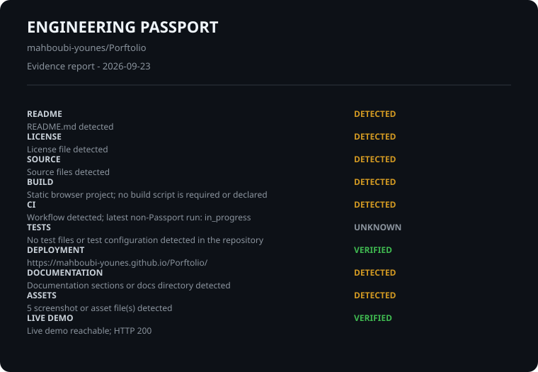

# Engineering Passport

Repository: mahboubi-younes/Porftolio

Evidence-first report. This is not a quality score or ranking.

## Evidence

- **README** | DETECTED | README.md detected
- **LICENSE** | DETECTED | License file detected
- **SOURCE** | DETECTED | Source files detected
- **BUILD** | UNKNOWN | Not detected
- **CI** | DETECTED | Workflow run found; latest conclusion: queued
- **TESTS** | UNKNOWN | Test files and configurations not detected
- **DEPLOYMENT** | VERIFIED | https://mahboubi-younes.github.io/Porftolio/
- **DOCUMENTATION** | DETECTED | Documentation sections or docs directory detected
- **ASSETS** | DETECTED | 5 screenshot or asset file(s) detected
- **LIVE DEMO** | DETECTED | URL declared in README: https://img.shields.io/badge/Live%20site-GitHub%20Pages-2ea44f?logo=github

## Technologies

JavaScript

## Verification context

- Generated: 2026-09-23T12:01:05.422Z
- GitHub API: Repository metadata read from GitHub API

Unknown means evidence was unavailable; no claim is made.
